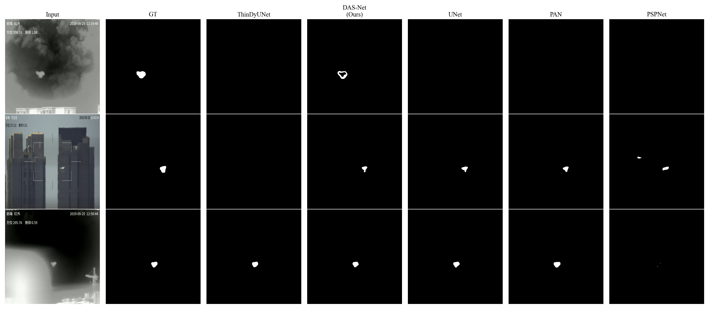
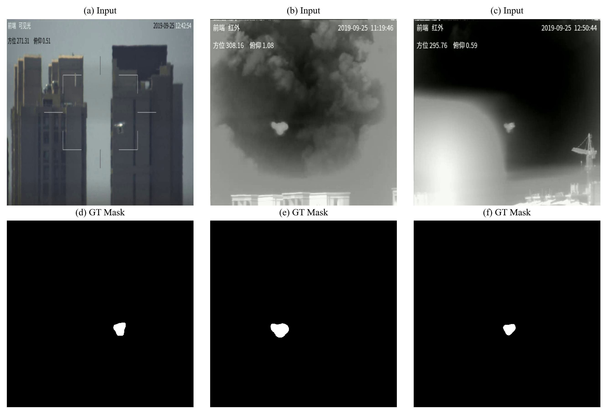
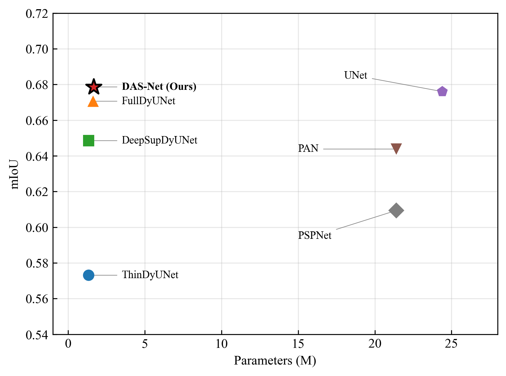
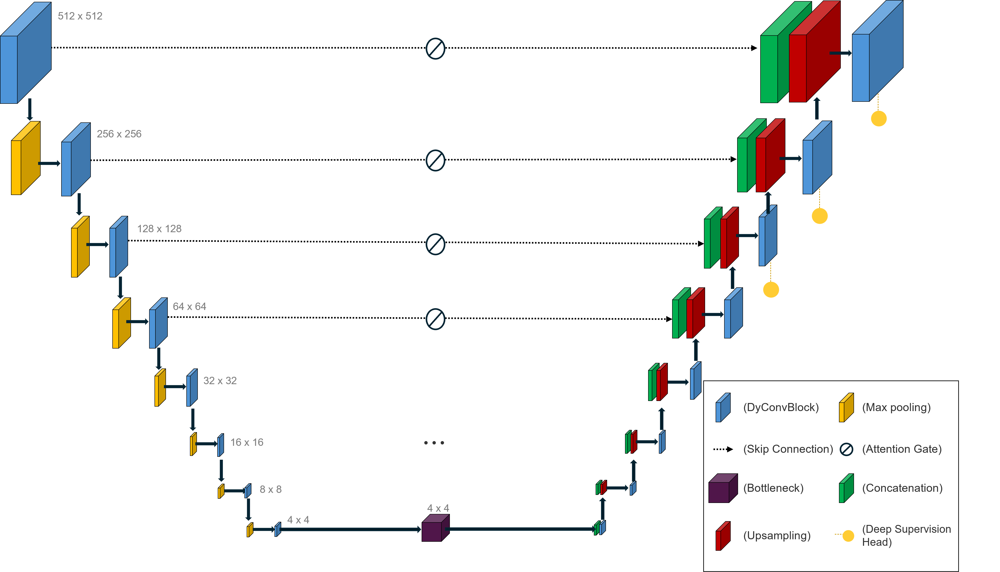
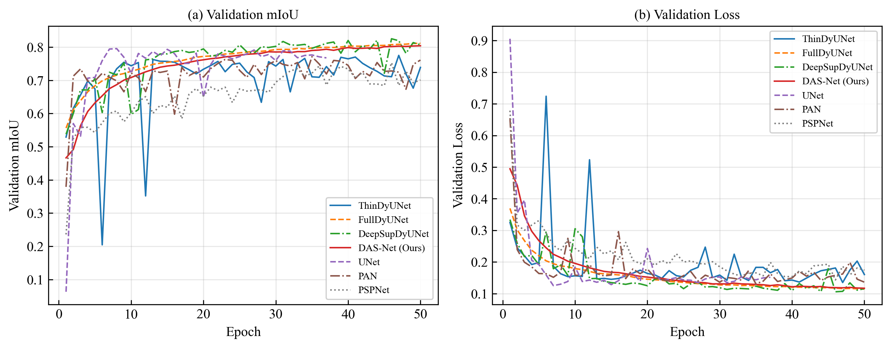

# DAS-Net

**A Lightweight Dynamic Convolution Network with Attention Gates and Deep Supervision for UAV Semantic Segmentation**

[](https://www.mdpi.com/journal/applsci)
[](https://opensource.org/licenses/MIT)
[](https://www.python.org/downloads/)
[](https://pytorch.org/)

> **Real-time anti-UAV semantic segmentation with only 1.66M parameters.**

---

##  Highlights

-  **Lightweight**: 1.66 M parameters (14.7× smaller than ResNet-34 UNet)
-  **Accurate**: Matches UNet (mean test mIoU **0.6780** vs. 0.6760) on a 174,008-image test set
-  **Real-time**: **113 FPS** on NVIDIA A6000 GPU (FP32, batch size 1, 512×512)
-  **Statistically validated**: Three-seed Monte Carlo cross-validation (p = 0.045, Cohen's d = 1.74)
-  **Anti-UAV ready**: Designed for resource-constrained UAV surveillance platforms

---

## 📋 Table of Contents

- [Overview](#overview)
- [Visual Results](#-visual-results)
- [Architecture](#architecture)
- [Quantitative Results](#quantitative-results)
- [Installation](#installation)
- [Usage](#usage)
- [Citation](#citation)
- [License](#license)
- [Acknowledgements](#acknowledgements)

---

## Overview

**DAS-Net (Dynamic Attention-Supervised Network)** extends the lightweight ThinDyUNet baseline with three architectural improvements for UAV semantic segmentation:

1. **Symmetric Dynamic Convolution**: applied to both encoder and decoder paths (vs. encoder-only in ThinDyUNet)
2. **Attention Gates**: filter encoder features at skip connections before concatenation with decoder features
3. **Deep Supervision**: auxiliary loss heads at the last three decoder stages (λ = 0.4) — discarded at inference

The result is a 1.66 M-parameter model that achieves UNet-level accuracy at 14.7× fewer parameters and runs at real-time speeds on workstation GPUs.

---

## 🖼 Visual Results

### Qualitative Segmentation Comparison



**Detection examples on three test scenes** (top → bottom):
- **Top row**: Clear visible-light (VL) scene
- **Middle row**: Infrared (IR) scene with cluttered background
- **Bottom row**: IR scene with small, distant UAV target

Columns (left → right): Input image, Ground-truth mask, ThinDyUNet, **DAS-Net (Ours)**, MobileUNet, UNet, PAN, PSPNet.

**Observations**: DAS-Net produces masks consistently closer to the ground truth than other models, particularly for **small or partially occluded targets** where ThinDyUNet often misses detection. The attention gates effectively suppress background clutter while the symmetric DyConv decoder restores fine-grained UAV boundaries.

### Dataset Samples



**Sample inputs**: (a) visible light (VL), (b) IR under clear weather, (c) IR under foggy conditions. (d–f) Corresponding ground-truth segmentation masks. Note the small UAV target relative to the entire frame, which is a key challenge for accurate segmentation.

### Parameter Efficiency



**Trade-off between model size and segmentation accuracy**: DAS-Net achieves the highest mIoU among lightweight models (≤ 2 M parameters) and is competitive with UNet (24.4 M) while using **14.7× fewer parameters**, placing it strongly on the Pareto frontier.

---

## Architecture



**DAS-Net architecture overview**: Symmetric encoder-decoder with DyConvBlocks (K=2 parallel kernels) in both paths, attention gates filtering all skip connections, and deep supervision auxiliary heads attached to the last three decoder stages (used only during training).

### Component Comparison (Ablation Variants)

| Model | Encoder | Decoder | Attention Gate | Deep Supervision | Params (M) |
|---|---|---|---|---|---|
| ThinDyUNet (baseline) | DyConvBlock | MultiCNNBlock | — | — | 1.34 |
| FullDyUNet | DyConvBlock | DyConvBlock | — | — | 1.63 |
| DeepSupDyUNet | DyConvBlock | MultiCNNBlock | — | ✓ (λ=0.4) | 1.34 |
| **DAS-Net (Ours)** | **DyConvBlock** | **DyConvBlock** | **✓** | **✓ (λ=0.4)** | **1.66** |

---

## Quantitative Results

### Test Set Performance (174,008 images, mean across 3 seeds)

| Model | Params (M) | Precision | Recall | Dice | mIoU | A6000 (ms) | FPS |
|---|---|---|---|---|---|---|---|
| ThinDyUNet | 1.34 | 0.9308 | 0.6449 | 0.6766 | 0.6115 | 8.29 | 120.6 |
| PSPNet | 21.4 | 0.8554 | 0.6685 | 0.6768 | 0.6094 | 11.46 | 87.3 |
| MobileUNet | 6.0 | 0.9248 | 0.6593 | 0.6790 | 0.6185 | 10.23 | 97.7 |
| PAN | 21.4 | 0.9055 | 0.7047 | 0.7045 | 0.6438 | 11.16 | 89.6 |
| FullDyUNet | 1.63 | 0.8816 | 0.6994 | 0.7159 | 0.6451 | 9.04 | 110.7 |
| DeepSupDyUNet | 1.34 | 0.9268 | 0.7063 | 0.7222 | 0.6627 | 8.26 | 121.0 |
| UNet | 24.4 | 0.9004 | 0.7333 | 0.7413 | 0.6760 | 9.93 | 100.7 |
| **DAS-Net (Ours)** | **1.66** | 0.8422 | **0.7643** | **0.7509** | **0.6780** | 8.83 | 113.2 |

DAS-Net matches UNet's mIoU (0.6780 vs. 0.6760) with **14.7× fewer parameters** and achieves the highest mIoU among lightweight models (≤ 2 M parameters).

### Training Curves



DAS-Net converges smoothly and achieves the highest validation mIoU by the end of training, with the lowest validation loss among all compared models.

---

## Installation

### Requirements
- Python 3.8+
- PyTorch 2.0+
- CUDA 11.x or 12.x
- NVIDIA GPU (8+ GB VRAM recommended for training)

### Setup
```bash
# Clone repository
git clone https://github.com/niceyoungjae/DAS-net.git
cd DAS-net

# Create conda environment (recommended)
conda create -n dasnet python=3.10 -y
conda activate dasnet

# Install dependencies
pip install -r requirements.txt
```

See [`docs/INSTALLATION.md`](docs/INSTALLATION.md) for detailed setup including dataset preparation.

---

## Usage

### Dataset

We use the UAV semantic segmentation dataset proposed in [Kim & Jang, *Appl. Sci.* 2025](https://doi.org/10.3390/app15137183).

- **Reference paper**: https://doi.org/10.3390/app15137183
- **Public source**: https://github.com/SCKIMOSU/uav
- **Size**: 605,045 paired VL + IR images (1920×1080)
- **Split**: 304,677 train / 126,360 val / 174,008 test

For full dataset access, please refer to the original publication or contact the dataset authors at sckim7@kookmin.ac.kr.

### Training

Each model has its own dedicated training script:

```bash
# Train DAS-Net
python scripts/train_dasnet.py --config configs/config_dasnet.yaml

# Train ablation variants
python scripts/train_thindyunet.py --config configs/config_thindyunet.yaml
python scripts/train_fulldyunet.py --config configs/config_fulldyunet.yaml
python scripts/train_deepsupdyunet.py --config configs/config_deepsupdyunet.yaml

# Train external baselines
python scripts/train_unet.py --config configs/config_unet.yaml
python scripts/train_mobileunet.py --config configs/config_mobileunet.yaml
python scripts/train_pan.py --config configs/config_pan.yaml
python scripts/train_pspnet.py --config configs/config_pspnet.yaml
```

### Evaluation

```bash
# Evaluate DAS-Net (loads checkpoint from configs)
python scripts/test_dasnet.py --config configs/config_dasnet.yaml

# Or use the generic eval script
python scripts/eval.py --model dasnet --checkpoint <path-to-best.pth>
```

See [`docs/USAGE.md`](docs/USAGE.md) for advanced options including multi-seed training and custom inference.

---

## Project Structure

```
DAS-net/
├── README.md                  ← You are here
├── LICENSE                    ← MIT License
├── requirements.txt           ← Python dependencies
├── CITATION.cff               ← How to cite
├── configs/                   ← YAML configs for 8 models
│   ├── config_dasnet.yaml
│   ├── config_thindyunet.yaml
│   └── ...
├── model/                     ← Model definitions
│   ├── DASNet.py
│   ├── ThinDyUNet.py
│   ├── FullDyUNet.py
│   ├── DeepSupDyUNet.py
│   └── _base.py
├── dataset/                   ← Data loader
├── scripts/                   ← Training & evaluation
│   ├── train_*.py             ← Per-model training (8 total)
│   ├── test_*.py              ← Per-model evaluation (8 total)
│   ├── trainer.py             ← Common training utilities
│   └── eval.py                ← Generic evaluation
├── utils/                     ← Common utilities (early stop, model save)
├── docs/                      ← Detailed documentation
└── figures/                   ← Paper figures (PNG)
```

---

## Citation

If you find this work useful, please cite our paper:

```bibtex
@article{kim2026dasnet,
  title   = {DAS-Net: A Lightweight Dynamic Convolution Network with Attention Gates
             and Deep Supervision for UAV Semantic Segmentation},
  author  = {Kim, Young Jae and Kim, Sang-Chul},
  journal = {Applied Sciences},
  year    = {2026},
  note    = {Under review (Major Revision Submitted, applsci-4300704)}
}
```

Also consider citing the underlying dataset:

```bibtex
@article{kim2025dataset,
  title   = {A Semantic Segmentation Dataset and Real-Time Localization Model
             for Anti-UAV Applications},
  author  = {Kim, Sang-Chul and Jang, Yeong Min},
  journal = {Applied Sciences},
  volume  = {15},
  pages   = {7183},
  year    = {2025},
  doi     = {10.3390/app15137183}
}
```

---

## License

This project is licensed under the **MIT License** — see [LICENSE](LICENSE) for details.

---

## Acknowledgements

- **Funding**: This work was supported by the Korea Research Institute for Defense Technology Planning and Advancement (KRIT) grant funded by the Korean government [DAPA] under Grant **KRIT-CT-23-041** (LiDAR/RADAR-Supported Edge AI-based Highly Reliable IR/UV FSO/OCC Specialized Research Laboratory, 2024).
- **Dataset**: We thank the authors of [Kim & Jang, 2025](https://doi.org/10.3390/app15137183) for the UAV semantic segmentation dataset.
- **Implementations**: External baselines (UNet, MobileUNet, PAN, PSPNet) are implemented via [`segmentation_models.pytorch`](https://github.com/qubvel-org/segmentation_models.pytorch).

---

## Contact

- **Young Jae Kim** (First Author, Corresponding Author): niceyj16@kookmin.ac.kr
- **Sang-Chul Kim** (Corresponding Author): sckim7@kookmin.ac.kr
- **Affiliation**: Department of AI·SW / School of Computer Science, Kookmin University, Seoul, Republic of Korea

For questions, please open a [GitHub Issue](https://github.com/niceyoungjae/DAS-net/issues).

---

⭐ **Star this repo** if you find it useful!
